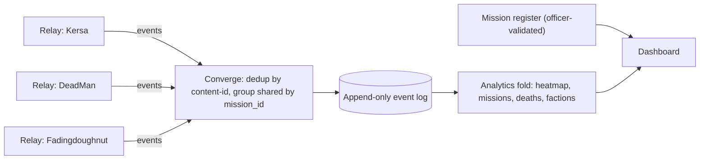

# DESIGN — Event convergence (merging multiple players' streams)

> **Status:** Design note for hand-off to the master dev. Describes how to merge
> gameplay-event streams from many players' relays into one org-wide view —
> transport-agnostic, so it works for the **central hub (M4)** now and a **Fabric /
> federated** transport (D-004) later without changing the merge logic.
> **Audience:** whoever builds M4+ and any future Fabric workload.
> Related: `DESIGN-distributed.md` (transport/federation), `DECISIONS.md` D-004/D-005.

---

## 1. What exists today (the seam)

The relay is already shaped for this; it just isn't a *signed, multi-source* feed yet.

- **Typed envelope** — every parsed line becomes an ActivityStreams/Fabric-shaped
  object (`app/server.js`, `_record`/activity wrap):
  ```js
  { type: 'StarCitizenLogEntry', id, kind, timestamp, object: { id, content }, target }
  ```
- **Event `kind`** — `player:death`, `mission:start`, `mission:end`, `kill`,
  `player:incap`, `mission:notification`, … (the parser's classification).
- **Content-addressed IDs** — `idFor(content) = sha256(content).slice(0,32)`
  (`app/server.js:35`). Content addressing is the key primitive for dedup.
- **A POST seam** — `POST …/{activities,players,vehicles,kills}` already accepts
  remote events (`app/server.js` ~L245) "for future remote relays".
- **Signing groundwork** — `types/Mission.js` (secp256k1 / musig2) is the basis for
  per-source signatures (reserved M6).

**Gaps for convergence:** events have **no explicit `source` (node/relay) identity**
and **no signature**. Attribution is implicit — everything is tagged to
`this._sessionHandle`, the local player.

---

## 2. Two planes — keep them separate

Do **not** try to make one consistency model serve both. They have different needs.

| Plane | What | Consistency | Authority |
|---|---|---|---|
| **Event firehose** | observed gameplay (deaths, missions, kills, sessions) | append-only, **eventually consistent**, union-merged | the producing relay (self-reported; *authorship*, not truth) |
| **Mission register** | officer-validated missions / fleet actions + audit | **strongly consistent**, single source of truth | a human officer (D-005) |

The firehose feeds **analytics**; the register stays **authoritative**. The log can
never be the source of truth (D-005) — so the firehose only needs to be *attributable*,
not *trusted*.

---

## 3. Convergence model (transport-agnostic)

**Merge = union of per-source event logs, deduped by content-id, with shared events
grouped on natural keys.** Concretely:

1. **Event identity = content-address + source.** Compute each id as
   `hash(sourceNodeId + kind + canonicalFields + timestamp)`. Re-delivering the same
   event yields the same id → **idempotent upsert → automatic dedup**. This turns
   "converge N streams" into "union by id". (Extend the existing `idFor()`.)
2. **Origin on every event.** Add `source` (relay/node id — ideally a pubkey) and
   `actor` (player handle) as first-class fields. Implicit `_sessionHandle`
   attribution is not enough once streams mix.
3. **The log is self-centric → mostly union, not consensus.** SC only logs events
   *involving the running player* (your kills since 4.0.2, your death corpse, your
   missions). Two players' streams rarely describe the **same** event, so the common
   case is a clean union of disjoint events — **no CRDTs / vector clocks required.**
4. **Ordering = timestamps, append-only.** Immutable observations with ISO-UTC
   timestamps; order by `(timestamp, source)`. No mutable shared state → last-writer-
   wins per key suffices.
5. **Store = append-only event log; analytics = a fold over it.** Already true:
   `scripts/backfill.js` folds per-source events into `stores/history.json`;
   `GET …/analytics` folds history + live. **Converging relays = merge their event
   logs (dedup by id); the existing aggregation pipeline works unchanged.** The
   convergence layer slots in *underneath* the analytics already built.

---

## 4. Shared events — reconcile on natural keys

The few genuinely cross-player events:

- **Party / shared missions** — the same `mission_id` GUID appears in multiple
  players' logs (`PlayerJoined` push messages). **Group by `mission_id` across
  sources** → one mission with N participants. (Each player still owns their own
  `mission:end` / `CompletionType`.)
- **≤4.3.0 kills** — a kill can appear in the killer's *and* the victim's log.
  Reconcile on `(victimId, timestamp)`. (Moot on 4.8.0 — kills aren't logged — but
  relevant for historic backfill.)

Everything else: union by content-id, no reconciliation needed.

---

## 5. Mapping to Fabric / federation

The envelope (`type`/`object`/`target`) + content-addressed ids + signed entities is
**already Fabric's Actor/Entity/Hub model**. The migration is a *transport swap*, not
a redesign:

- Give each relay a **keypair identity**; `sourceNodeId` = its pubkey.
- Wrap each event as a **signed Entity** (the `types/Mission.js` pattern). Signature
  proves **authorship** (who said it), not **truth** (the honest D-004 limit) — which
  is exactly what analytics needs and all decentralization can give.
- Gossip via a **Hub** instead of POSTing to the central VPS.

The §3 merge rules sit on top **unchanged**. **Build the convergence semantics against
the cheap central hub first** (M4 — no NAT traversal / discovery), then swap transport
to Fabric later if/when the org wants to drop the single VPS (the D-004 trigger).

---

## 6. Flow



Transport (POST to VPS, or Fabric gossip) only changes the left edge; everything from
`HUB` rightward is identical.

---

## 7. Proposed first step (not yet built — needs owner go-ahead)

Small, high-leverage, and it de-risks everything above:

1. Add `source` (relay id; pubkey later) + `actor` to the event envelope, and make the
   canonical `id` include `source` so the store dedups on re-delivery.
2. Make the existing `POST …/<collection>` seam **idempotent** (upsert by that id) and
   record `source`.
3. Stand up a tiny **local hub mode** (one relay forwards to another instance on the
   LAN) to prove multi-source merge end-to-end — **no VPS cost**.

Outcome: the central hub (M4) immediately produces a converged, dedup-able stream, and
Fabric later is a pure transport swap. Keep signing (M6) and Fabric gossip as separate,
later increments on top of this same model.
