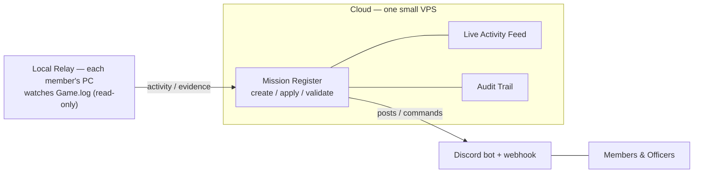
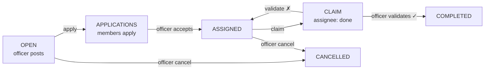
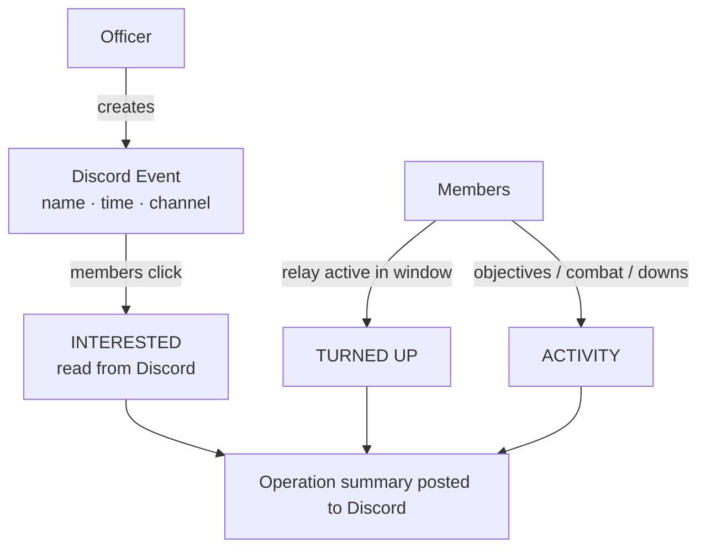
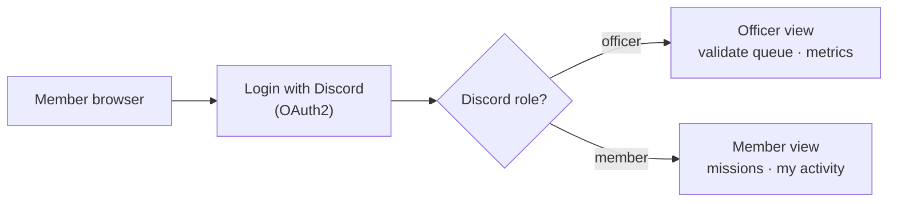
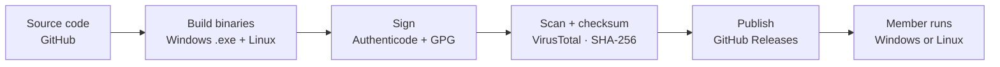
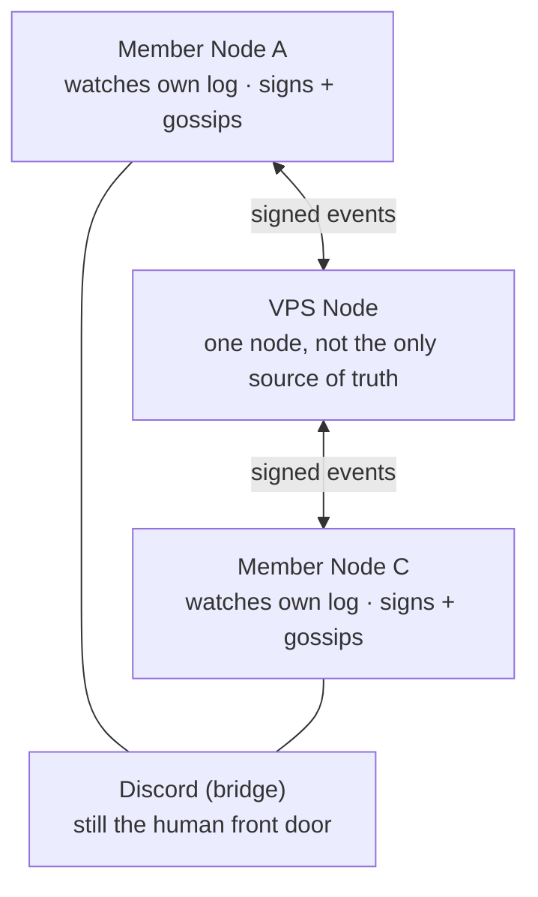

# Permafleet Mission Platform — Solution Brief

> A live Star Citizen activity relay + an officer-validated mission register for the org.
> **Status:** working prototype, expanding · Last updated 14 June 2026.
> This is the GitHub-renderable version of `Permafleet-Solution-Brief.docx` (same content; diagrams render inline below).

**Contents:** [Origin & requirements](#origin--original-requirements-from-the-master) · [Deviations](#how-this-fork-has-deviated-and-why) · [Executive summary](#executive-summary) · [What it is](#1-what-this-is) · [Where we are](#2-where-we-are-now) · [User capabilities](#3-what-users-can-do) · [Lifecycle](#4-the-mission-register--lifecycle) · [Discord Events](#5-the-discord-events-hook) · [Feed & metrics](#6-making-a-busy-feed-useful--filters-grouping-metrics) · [Web UI](#7-future-web-ui-discord-role-gated) · [Packaging](#8-packaging--distribution-windows--linux) · [Decentralized option](#9-future-option--decentralized-deployment) · [Dependencies](#10-external-dependencies--indicative-costs) · [Roadmap](#11-roadmap) · [Decisions](#12-decisions-for-the-product-owner) · [Limitations](#13-honest-limitations)

---

## Origin & original requirements (from the master)

This project originates from the master repository established under the org's direction (upstream: `GoonCitizen/star-citizen-live`; fork basis: `martindale/star-citizen-live`, branch `feature/fabric-0.1.0`; package `@rsi/star-citizen`; MIT licence). The work in this fork (`Neorion/star-citizen-live`, branch `feature/fabric-free-m1`) continues that project. This section records the requirements as defined in the master so the subsequent changes can be read against them.

**Requirements as defined in the master:**

1. Watch the Star Citizen `Game.log` live, read-only.
2. Relay events to a Discord channel as rich embeds (activities, kills, player joins, missions, applications).
3. Expose a REST API (port 3041) with collections: activities, players, vehicles, kills, messages/logs, missions, applications, status.
4. Detect specific in-game events from the log (e.g. kills, player joins, vehicle destruction).
5. Provide a missions/contracts system: members post missions (bounty / cargo / exploration) with UEC rewards; others apply; contracts cryptographically signed — single-signer or multisig (`secp256k1` / `musig2`).
6. Run on the Fabric framework as a decentralized peer-to-peer service (signed, content-addressed objects), extending a Fabric Hub.
7. Provide a web user interface (React / server-rendered Semantic UI).

## How this fork has deviated (and why)

The fork pursues the same goals. The changes below were made for the technical reasons stated; each is recorded in `DECISIONS.md` (D-001…D-005) and `PROGRESS.md`.

| Area | Master (original) | This fork | Reason |
|---|---|---|---|
| Framework | Fabric (p2p), extends Hub | Standard Node.js built-ins (http, events, crypto) | Fabric ~400 MB incl. a headless browser; deps installed over SSH GitHub URLs that failed on clean machines; a core package absent from the dependency list; install never completed in a clean environment (D-002). |
| Hosting / trust | Trustless p2p network | One central service on a VPS; Discord for identity | The required functions (watch log, post to Discord, share contracts) do not require p2p; the org has a defined authority (D-003). |
| Mission contracts | Crypto single/multisig contracts | Central register with officer validation; crypto/multisig deferred (seam + `types/Mission.js` retained) | A player's log is self-reported and cannot prove completion; an officer validates (D-005). |
| Kill detection | "Kills announced to Discord" | Mission/objective tracking + combat-objective proxy + player-down detection | SC 4.7.0–4.8.0 client logs record no kills or ship destruction (verified across 193 logs, two players) (M3, M3.5, M3.13). |
| Install footprint | ~400 MB Fabric dependency tree | Zero runtime dependencies | Removing Fabric eliminated the dependency tree (M2, M3.7). |
| Web UI | React / Semantic UI shell | Built-in HTML dashboard; Discord-role-gated web UI planned | Rebuilt without the Fabric/React stack. |
| Decentralization | Core requirement (Fabric) | Optional future federation via signed gossip (not the Fabric framework) | Retained as an opt-in path, decoupled from the fragile transport (D-004). |

---

## Executive summary

The system has two parts: a **live activity relay** that each member runs locally to read the Star Citizen game log, and a **central mission register** where officers post missions and fleet actions, members apply, and **officers validate** on completion. All state changes are written to a tamper-evident audit log. **Discord is the primary interface.**

Testing across **193 logs from two players (builds 4.7.0–4.8.0)** established that the game records only the kills that **involve the running player** (your kills and your deaths) — not third-party kills (dropped in SC 4.0.2). Our parser was **verified on 417 real kills** from a member's logs — but only in SC ≤ 4.3.0; **CIG removed kill logging after 4.3.0**, so it is not available in the current game (confirmed across ~290 later files from three players). **Player-downs (incapacitation)** are also detected. A player's own log is also self-reported. The register therefore uses **officer validation** as the authority for completion, with log activity attached as supporting evidence where it exists. The same model applies to **out-of-game missions and fleet actions**, which have no log signal.

Current status: the live relay and dashboard are built and tested; the mission register engine and its REST API are built and verified end-to-end. Remaining work: a Discord bot to operate the register inside Discord, and hosting on an always-on server. A planned integration uses **Discord Scheduled Events** to capture interest, attendance and in-window activity.

A **federated deployment** — members' machines exchanging signed updates with no single point of failure — is retained as an optional future path (D-004), separate from the original Fabric framework. It is not required for the current scope.

---

## 1. What this is

Two halves that work together but are kept separate: a **Live Relay** on each member's PC (the only place the game log exists), and a **Central Service** in the cloud that holds the shared mission register, the activity feed, and the audit trail. **Discord is the front door** everyone already uses.

## 2. Where we are now

| Capability | Status |
|---|---|
| Live dashboard — sessions, players, missions, combat-progress, downs, notifications | Built & tested |
| Auto-detect game install & channel (LIVE / PTU / HOTFIX), survive restarts | Built & tested |
| Group missions by mission, with objectives nested | Built & tested |
| Mission-type classification (Bounty / Mercenary / Mining / …) | Built & tested |
| Player-down (incapacitation) detection | Built & tested |
| Regression testing against real player-log corpus | Built & tested |
| Live activity posted to Discord (one-way webhook) | Working once connected |
| Mission register — create / apply / assign / claim / officer-validate + audit | Built (engine + REST API), proven end-to-end |
| Mission register inside Discord (slash commands + Events hook) | Planned (M5.3) |
| Always-on cloud hosting | Planned (M4) |
| Kill detection (your kills/deaths) — historical logs only | Parser verified on 417 real kills (SC ≤ 4.3.0); CIG removed kill logging after 4.3.0 — not in current builds |
| Detecting third-party kills (others' fights) | Not possible — the game stopped logging them in 4.0.2 |
| Decentralized / no-central-server | Optional, later |

## 3. What users can do

**Member**
- Browse missions and fleet actions (reward, requirements, deadline).
- Apply from Discord; get assigned when an officer accepts.
- Mark a mission complete and (optionally) attach evidence the relay captured.
- See their own participation history.

**Officer / administrator**
- Post missions and fleet actions — including out-of-game ones the game cannot see.
- Accept or reject applications.
- Validate completions — the authority step that approves the reward.
- Manage who is an officer via a Discord role.
- See a tamper-evident audit trail of who created, applied to and approved everything.

## 4. The mission register & lifecycle

Every mission moves through an auditable lifecycle. The **officer validation** step is the authority for completion: because the log cannot prove completion, an officer confirms it.

## 5. The Discord Events hook

Officers already create **Discord Scheduled Events** and members already click "Interested." Discord's API exposes the interested-user list; the relay supplies who actually turned up and what they did during the event window. This produces a participation record per event — interested, turned-up and in-window activity — from a workflow already in use. The prerequisite is a one-time link between each member's relay and their Discord identity so activity can be attributed to the correct person.

## 6. Making a busy feed useful — filters, grouping, metrics

At fleet scale the feed is high-volume. Three controls reduce it:

**Filter by mission type or operation.** In-game mission types (Bounty, Mercenary/Defense, Hauling, Recovery, Mining, FPS/Facility, and others) are classified from the log's mission generator/template names — built and validated against a 193-log corpus. Org "operations" (e.g. "Tactical Strike Group" — a real announced Star Citizen feature) are officer-named labels that in-game activity rolls up under.

**Group, don't spam.**
- Group by mission (one card per mission, not per line).
- Roll up to operation level (one card per op).
- Edit a single message as it progresses, or use one thread per operation.
- Optional periodic digest instead of live events.

**Metrics.** Register data is validated by officers; log-derived data is inferred and labelled as such.

| Metric | Source | Confidence |
|---|---|---|
| Operation participation (distinct members active) | relays | inferred |
| Active-player-minutes per operation | relays | inferred |
| Objectives advanced / combat-progress per op | relays | inferred (proxy) |
| Player-downs (incapacitations) per session / op | relays | inferred |
| Missions completed per week; completion rate | register | validated |
| Average time-to-complete / time-to-validate | register | validated |
| Interest → turn-up conversion; no-show rate | Discord + relays | mixed |
| Member leaderboard (participation, not kills) | register | validated |

## 7. Future web UI (Discord-role-gated)

Discord remains the primary interface. A **web front end on the VPS** is a planned future addition (e.g. a validation queue and metrics dashboards). Members **log in with Discord** (no separate accounts) and their **Discord roles determine what they see** — officers get the admin views, members get their own. This is a placeholder for planning; not yet built.

## 8. Packaging & distribution (Windows & Linux)

For non-technical members the relay should be a single download that just runs — no Node.js install, no terminal. We need **both a Windows and a Linux** build: many members play on Windows, a growing number play via Proton/Wine on Linux, and the central service itself runs on a Linux server.

**Targets**

| Target | What we ship | How it runs |
|---|---|---|
| Windows relay | A single `.exe` (Node SEA; alt: pkg/nexe) | Double-click; optional auto-start as a background task |
| Linux relay | Self-contained binary + install script (tarball; optionally `.deb`/AppImage) | One-line install; optional systemd user service |
| Server (VPS) | The central service as a Linux systemd service | Always-on; survives reboots |

The Linux build adds Proton/Wine `Game.log` detection (Steam/Lutris compat folder).

**Virus-scan & trust.** Windows bundled-Node executables from an unknown publisher commonly trigger SmartScreen warnings and occasional AV false positives; Linux has no SmartScreen but still wants verifiable, signed downloads. The trust stack covers both:
- **Signing** — Windows: Authenticode (ideally EV) certificate; Linux: GPG-sign the binaries (and a GPG-signed apt repo for `.deb`).
- **VirusTotal** — upload each release and publish the report link.
- **GitHub Releases + SHA-256 checksums** — members confirm the file is unmodified; the build is auditable because the source is open.
- **False-positive submission** — submit a flagged release to Microsoft Defender (or a Linux AV) for review.

> Note: false positives are normal for this kind of executable; the combination of signing + VirusTotal + checksums + open source is how trust is established, not a single silver bullet.

## 9. Future option — decentralized deployment

The current plan uses one central server the org runs. The architecture also supports a **federated** version: members' own machines exchange **signed** updates so there is no single point of failure, with the cloud server becoming one node among several and Discord still the front door.

> **Status:** optional and deferred. The cryptographic building blocks already exist in the codebase (`types/Mission.js`). It is a sizeable effort and is not required for the current scope. Revisit only if removing reliance on the single server becomes a requirement, or to federate across multiple orgs (D-004).

## 10. External dependencies & indicative costs

| Dependency | What it's for | Cost / effort |
|---|---|---|
| Small cloud server (VPS) | Hosts the always-on register & feed | ~$5–10 / month |
| Discord bot | Two-way commands & the Events hook (a webhook can only post out) | Free; ~30 min setup |
| Discord server + Officer role | Identity and who-can-validate | Free; existing server |
| Each member runs the relay | Reads their local game log (Windows or Linux) | Free; small download |
| Code-signing certificate | Trusted Windows `.exe` (no SmartScreen); Linux uses free GPG | ~$200–600 / yr (Windows, optional) |
| Domain name | Friendly web address (web UI) | ~$10–15 / year (optional) |

Deliberately not needed: no blockchain, no cryptocurrency, no paid database, no app-store apps.

## 11. Roadmap

1. **M4 — Stand up the cloud server** (a home for the register). Needs: hosting choice/budget.
2. **M5 — Mission register**: API (done, M5.2) then Discord bot + Events hook (M5.3). Needs: create the Discord bot, define the Officer role.
3. **M6 — Officer roles + signed audit trail** (cryptographically signed validations).
4. **Ongoing — improve what the relay recognises** (never blocks the register).
5. **Later / optional — web UI and/or decentralization.**

## 12. Decisions for the product owner

1. Hosting provider and monthly budget.
2. Approve creating the Discord bot; choose which role = Officer.
3. Live-feed channel: public or private.
4. Confirm rewards are informational only (no real money / no blockchain).
5. Whether to buy a code-signing certificate for the `.exe` (improves member trust).

## 13. Honest limitations

- Kill logging was removed by CIG after SC 4.3.0. Our parser is verified on 417 real kills from ≤4.3.0 logs, but the current game (4.8.0) logs no kills at all — confirmed across ~290 later files from three players (combat happened, no kill lines). Player-down (incapacitation) IS still detected in current builds.
- In-game "activity" is only visible for members who run the relay.
- Activity attribution needs a one-time link between a member's relay and their Discord ID.
- Cross-player correlation of a shared mission is by type + operation + time window, unless the game exposes a shared id (to be confirmed against a real capture).
- A player's own log is self-reported — which is exactly why officer validation is the authority.

---

*Source and living technical docs (`DESIGN-missions-mvp.md`, `DECISIONS.md`, `PROGRESS.md`) are in the repository. A formatted Word version is `Permafleet-Solution-Brief.docx`.*
